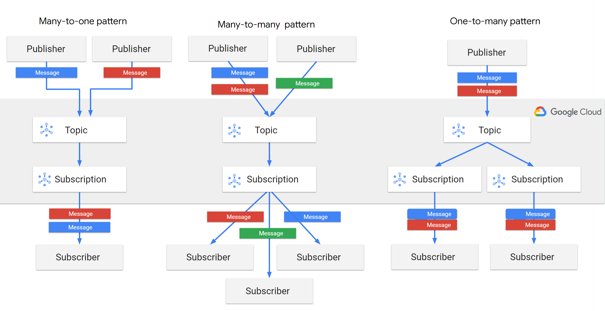

# Pubsub Eventflow

Pub/Sub is a publish/subscribe (Pub/Sub) service, a messaging service where the senders of messages are decoupled from the receivers of messages.

## Components of a Pub/Sub service

There are several key concepts in a Pub/Sub service which are explained with the help of the following figure.

The following are the components of a Pub/Sub service:

* **Publisher** (also called a producer): creates messages and sends (publishes) them to the messaging service on a specified topic.
* **Message**: the data that moves through the service.
* **Topic**: a named entity that represents a feed of messages.
* **Schema**: a named entity that governs the data format of a Pub/Sub message.
* **Subscription**: a named entity that represents an interest in receiving messages on a particular topic.
* **Subscriber** (also called a consumer): receives messages on a specified subscription.

## Lifecycle of a message in Pub/Sub

Assume that a single publisher client is connected to a topic. The topic has a single subscription attached to it. A single subscriber is connected to the subscription.

The following steps describe how a message flows in Pub/Sub:
1. A publisher application sends a message to a Pub/Sub topic.
2. The message is written to storage.
3. Along with writing the message to storage, Pub/Sub delivers the message to all the attached subscriptions of the topic.
4. The subscription sends the message to an attached subscriber application.
5. The subscriber sends an acknowledgment to Pub/Sub that they have processed the message.
6. After at least one subscriber for each subscription has acknowledged the message, Pub/Sub deletes the message from storage.

## Status of a message in Pub/Sub

There can be three states for a message in a Pub/Sub service:

* **Acknowledged messages (acked)**. After a subscriber application processes a message sent from a topic to a subscription, it sends an acknowledgment back to Pub/Sub. If all the subscriptions on a topic have acknowledged the message, the message is asynchronously deleted from the publish message source and from storage.

* **Unacknowledged messages (unacked)**. If Pub/Sub doesn't receive an acknowledgment within the acknowledgment deadline, a message might be delivered more than once. For example, the subscriber might send an acknowledgment after the deadline expires or the acknowledgment might be lost due to transient network issues. An unacknowledged message is continued to be delivered until the message retention duration expires since the message was published. At this point, the message expires.

* **Negatively acknowledged messages (nacked)**. Nacking a message by a subscriber causes Pub/Sub to redeliver it immediately. When a subscriber nacks messages that are invalid or when it cannot process the messages, the subscriber helps ensure that these messages are not lost and that they are eventually processed successfully. You can use modifyAckDeadline with a value of 0 to nack a message.

## Pub/Sub publish and subscribe pattern

When there are multiple publisher and subscriber clients, you must also choose the kind of publish and subscribe architecture that you want to set up.

Some of the supported Pub/Sub publish subscribe patterns include the following:

* **Fan in (many-to-one)**.
* **Load balanced (many-to-many)**.
* **Fan out (one-to-many)**.

In ReSy, we use **Fan in (many-to-one)** and **Fan out (one-to-many)** pattern.

## Push subscription workflow

There are multiple ways a published message can be delivered to a subscriber. ReSy uses the Push Subscription paradigm. In a push subscription, a Pub/Sub server initiates a request to your subscriber client to deliver messages.

1. The Pub/Sub server sends each message as an HTTPS request to the subscriber client at a pre-configured endpoint. This request is shown as a PushRequest in the image.
2. The endpoint acknowledges the message by returning an HTTP success status code. A non-success response indicates that Pub/Sub must resend the messages. This response is shown as a PushResponse in the image.
3. Pub/Sub dynamically adjusts the rate of push requests based on the rate at which it receives success responses.

After you receive a push request, return an HTTP status code. To acknowledge the message, return one of the following status codes:
* 102
* 200
* 201
* 202
* 204

To send a negative acknowledgment for the message, return any other status code. If you send a negative acknowledgment or the acknowledgment deadline expires, Pub/Sub resends the message. Pub/Sub will retry until the defined max deliver attempts limit is reached. After that, the message will be delivered to the dead letter queue defined for the subscription. For example, a subscription is defined for the shipmentunpack service here: https://github.com/otto-ec/backfish_resy_gcp/blob/a2e94a22222e3a4c7bbc2fde6308c01cd8644943/terraform/shipmentunpack/subscribtion.tf#L1-L12.

# ReSy event workflow sample

[workflow.drawio](eventmessage-flow.drawio ':include :type=code')

## The description of **Outbound1 event** workflow
1. *Service1* sends *Event1* to *Outbound1* topic.
2. *push-Service2* subscription recieves *Outbound1 event* from *Outbound1 topic*.
3. *push-Service3* subscription recieves *Outbound1 event* from *Outbound1 topic*.
4. *push-Service2* subscription sends HTTP request to the HTTP endpoint of *Service 2* and put *Event1* in the request body.
5. *push-Service3* subscription sends HTTP request to the HTTP endpoint of *Service 3* and put *Event1* in the request body.

### Successful event processing by *Service2*
1. *Service2* successfully processes *Event1*.
2. *Service2* replies the HTTP request back to *push-Service2* subscription with HTTP Status Code 200 (or any code in the successful code list).
3. *Event1* is regarded as "acked".

### Unsuccessful event processing by *Service3*
1. *Service3* fails at processing *Event1*
2. *Service3* performs error handling process (see next section for details)
3. *Service3* decides that retry is needed and replies the HTTP request back to *push-Service3* subscription with HTTP Status Code 500 (or any code no in the successful code list).
4. *push-Service3* subscription receives HTTP 500 and sees it as a "nacked" for *Event1*.
5. *push-Service3* check if retry limit is reached for *Event1*. If not, invokes the HTTP endpoint of *Service3*.
6. If retry lmit is reached for *Event1*, *push-Service3* delievers the event to the designated dead letter queue *Outbound1-dl* and stops processing.

## Details of error handling process performed by *Service3*
[error-handling.drawio](eventmessage-flow.drawio ':include :type=code')

1. *Service3* encounters processing error of *Event1*
2. *Service3* writes error logs if necessary. In general, if the error is an expected behavior and no further attention or operation is needed, the error does not need to be logged.
3. *Service3* decides if the error is a business error or a technical error.
    * In general, if the event contains error such as incorrect inbound data and cannot be fixed without the publisher fixing the data and sending the event again, it can be regarded as business errors. Such errors will not need any retry because no matter how many retries attempted, the same error will happen again.
    * On the contrary, if the error is caused by an unexpected technical reason such as MongoDB connection errors, it should be treated as a technical error. Such errors could be retried as the next attempt might succeed after a temporary network outage.
4. If the error falls into the business category, *Service3* responds the HTTP request with HTTP Status Code 200 (or any other codes in the successful code list) to mark the event as acked and ends the process.
5. If the error falls into the technical category, *Service3* will
    * publish the error to errorMessage pubsub topic, such that RESY administrators will have a chance to check the error details from Error Handler UI and triggers retries from there.
    * return with HTTP Status Code 500 or any other codes not in the successful code list to marked the event as nacked which will in turn trigger a retry.
    * send a shutdown signal to shutdown the service, in the hope that after the service restarted the technical error could go away.