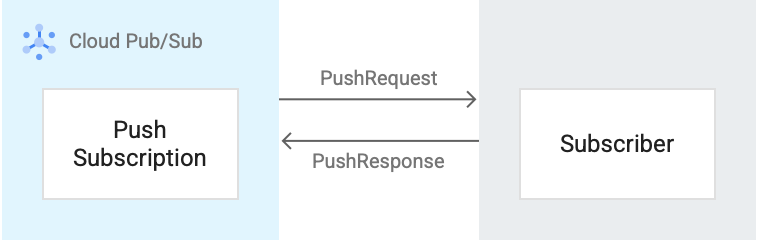

# Pubsub Eventflow

Pub/Sub is a publish/subscribe (Pub/Sub) service, a messaging service where the senders of messages are decoupled from the receivers of messages.

## Components of a Pub/Sub service

There are several key concepts in a Pub/Sub service which are explained with the help of the following figure.

The following are the components of a Pub/Sub service:

* **Publisher** (also called a producer): creates messages and sends (publishes) them to the messaging service on a specified topic.
* **Message**: the data that moves through the service.
* **Topic**: a named entity that represents a feed of messages.
* **Schema**: a named entity that governs the data format of a Pub/Sub message.
* **Subscription**: a named entity that represents an interest in receiving messages on a particular topic.
* **Subscriber** (also called a consumer): receives messages on a specified subscription.

## Lifecycle of a message in Pub/Sub

Assume that a single publisher client is connected to a topic. The topic has a single subscription attached to it. A single subscriber is connected to the subscription.

The following steps describe how a message flows in Pub/Sub:
1. A publisher application sends a message to a Pub/Sub topic.
2. The message is written to storage.
3. Along with writing the message to storage, Pub/Sub delivers the message to all the attached subscriptions of the topic.
4. The subscription sends the message to an attached subscriber application.
5. The subscriber sends an acknowledgment to Pub/Sub that they have processed the message.
6. After at least one subscriber for each subscription has acknowledged the message, Pub/Sub deletes the message from storage.

## Status of a message in Pub/Sub

While a message is outstanding to a subscriber, Pub/Sub tries not to deliver it to any other subscriber on the same subscription. The subscriber has a configurable, limited amount of time, known as the ackDeadline, to acknowledge the outstanding message. After the deadline passes, the message is no longer considered outstanding, and Pub/Sub attempts to redeliver the message.

There can be three states for a message in a Pub/Sub service:

* **Acknowledged messages (acked)**. After a subscriber application processes a message sent from a topic to a subscription, it sends an acknowledgment back to Pub/Sub. If all the subscriptions on a topic have acknowledged the message, the message is asynchronously deleted from the publish message source and from storage.

* **Unacknowledged messages (unacked)**. If Pub/Sub doesn't receive an acknowledgment within the acknowledgment deadline, a message might be delivered more than once. For example, the subscriber might send an acknowledgment after the deadline expires or the acknowledgment might be lost due to transient network issues. An unacknowledged message is continued to be delivered until the message retention duration expires since the message was published. At this point, the message expires.

* **Negatively acknowledged messages (nacked)**. Nacking a message by a subscriber causes Pub/Sub to redeliver it immediately. When a subscriber nacks messages that are invalid or when it cannot process the messages, the subscriber helps ensure that these messages are not lost and that they are eventually processed successfully. You can use modifyAckDeadline with a value of 0 to nack a message.

## Pub/Sub publish and subscribe pattern

When there are multiple publisher and subscriber clients, you must also choose the kind of publish and subscribe architecture that you want to set up.

Some of the supported Pub/Sub publish subscribe patterns include the following:

* **Fan in (many-to-one)**. In this example, multiple publisher applications publish messages to a single topic. This single topic is attached to a single subscription. The subscription is, in turn, connected to a single subscriber application that gets all the published messages from the topic.

* **Load balanced (many-to-many)**. In this example, a single or multiple publisher applications publish messages to a single topic. This single topic is attached to a single subscription that is, in turn, connected to multiple subscriber applications. Each of the subscriber applications gets a subset of the published messages, and no two subscriber applications get the same subset of messages. In this load balancing case, you use multiple subscribers to process messages at scale. If more messages need to be supported, you add more subscribers to receive messages from the same subscription.

* **Fan out (one-to-many)**. In this example, a single or multiple publisher applications publish messages to a single topic. This single topic is attached to multiple subscriptions. Each subscription is connected to a single subscriber application. Each of the subscriber applications gets the same set of published messages from the topic. When a topic has multiple subscriptions, then every message has to be sent to a subscriber receiving messages on behalf of each subscription. If you need to perform different data operations on the same set of messages, fan out is a good option. You can also attach multiple subscribers to each subscription and get a load-balanced subset of messages for each subscriber.

In ReSy, we use **Fan in (many-to-one)** and **Fan out (one-to-many)** pattern.

## Push subscription workflow

In a push subscription, a Pub/Sub server initiates a request to your subscriber client to deliver messages.

1. The Pub/Sub server sends each message as an HTTPS request to the subscriber client at a pre-configured endpoint. This request is shown as a PushRequest in the image.
2. The endpoint acknowledges the message by returning an HTTP success status code. A non-success response indicates that Pub/Sub must resend the messages. This response is shown as a PushResponse in the image.
3. Pub/Sub dynamically adjusts the rate of push requests based on the rate at which it receives success responses.

After you receive a push request, return an HTTP status code. To acknowledge the message, return one of the following status codes:
* 102
* 200
* 201
* 202
* 204

To send a negative acknowledgment for the message, return any other status code. If you send a negative acknowledgment or the acknowledgment deadline expires, Pub/Sub resends the message. 

## ReSy pubsub workflow

[workflow.drawio](eventmessage-flow.drawio ':include :type=code')